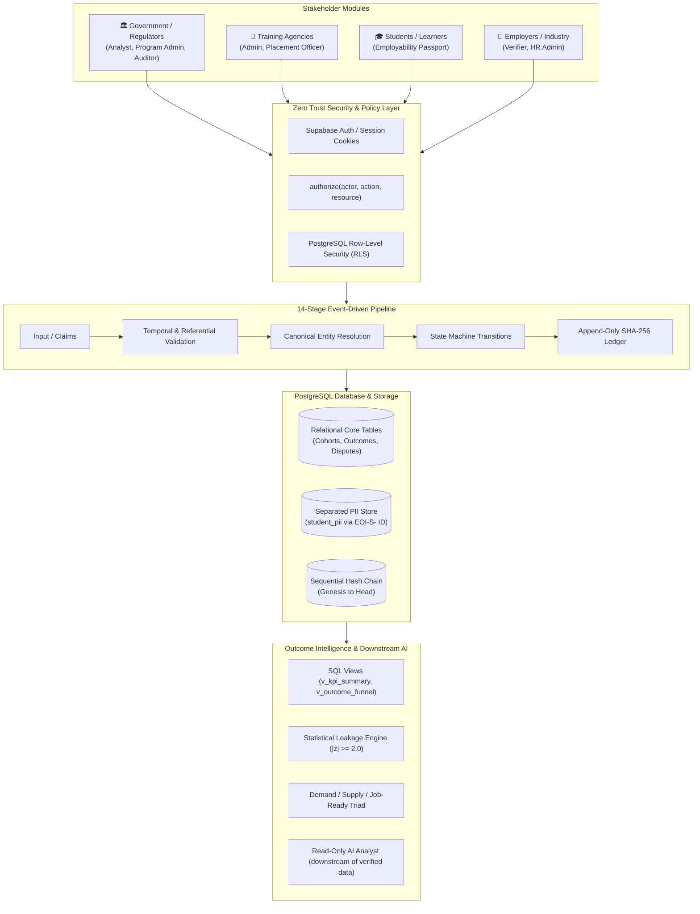

# Employment Outcome Intelligence (EOI) Platform
### *A Trusted, Automated, Longitudinal Outcome Layer for Government*
**Target: Smart India Hackathon (SIH) 2026 · Problem ID: SIH26135**

---

> **Core Product Thesis:** `TRUST → TRAJECTORY → INTELLIGENCE → ACTION`  
> *"The dashboard is not the source of truth. The verified event history is."*  
> *"We don't just track who was trained. We track what happened next, verify it, preserve it, and learn from it."*

---

## 1. Executive Summary & Purpose

The **Employment Outcome Intelligence (EOI) Platform** bridges the critical four-way gap in India's vocational training ecosystem:
1. **Trust Gap:** Reported placement numbers from training agencies differ substantially from actual verifiable employment on the ground (motivated by CAG placement audit findings).
2. **Trajectory Gap:** Employment is not a one-time boolean; it is a longitudinal lifecycle (*Employed → Unemployed → Re-employed*).
3. **Skill Gap:** A structural disconnect between training curricula and actual industry demand.
4. **Decision Gap:** Lack of verifiable, empirical decision-support tooling for state and central skill development authorities.

The EOI Platform sits around existing systems (SIDH, NCS, e-Shram, EPFO, ESIC) without replacing them, functioning as a cryptographically verifiable ledger and outcome analytics layer.

---

## 2. High-Level Architecture



---

## 3. Non-Negotiable Security Invariants

- **P1: No Single Stakeholder Controls Truth:** An agency can report employment but cannot verify its own report. A student can report unemployment but cannot rewrite verified employer records. An employer can verify but cannot alter training history.
- **P2: No Master Administrator:** No superadmin can bypass audit trails or silently modify outcome records. Critical actions (scoring version changes, claim overrides) require **multi-party authorization** (`requester_id != approver_id`).
- **P3: Machines Do Routine Work:** Validation, entity matching, workflow transitions, notifications, and anomaly detection are automated. Humans handle disputes and exceptions.
- **P4: Historical Truth is Never Destroyed:** Status transitions append new events. `UPDATE` and `DELETE` on outcome history are permanently blocked by database triggers raising `SQLSTATE 42501`.
- **P5: AI is Never the Source of Truth:** Downstream analytical interpreter with read-only access to whitelisted SQL views. Every answer must cite exact structured evidence records.

---

## 4. Evaluator Demo Accounts & Credentials

All test accounts share the universal demo password: **`Demo@EOI2026`**

| Role Identifier | Email Address | Stakeholder / Scope | Primary Demo Capabilities |
|---|---|---|---|
| `gov_analyst` | `gov.analyst@eoi.demo` | Government | Outcome Funnel, Leakage Engine, Simulator, AI Analyst |
| `gov_auditor` | `gov.auditor@eoi.demo` | Government (CAG / Audit) | Cryptographic Hash Verification, Raw Audit Ledger |
| `gov_program_admin` | `gov.admin@eoi.demo` | Government | Program Governance, Multi-party Authorization Queue |
| `agency_officer` | `agency.officer@eoi.demo` | Delhi Skill Dev Institute | Student Rosters, CSV Bulk Import, Placement Reporting |
| `agency_admin` | `agency.admin@eoi.demo` | Delhi Skill Dev Institute | Accredited Curriculum, Cohorts, Staff Assignments |
| `student` | `student.x@eoi.demo` | Arjun Singh (`EOI-S-HERO-0001`) | Employability Passport, Report Unemployment, Dispute |
| `employer_verifier` | `employer.verifier@eoi.demo` | Google India Pvt. Ltd. | Verification Queue, Departure Reconciliation, Feedback |
| `security_officer` | `security.officer@eoi.demo` | Platform Ops | ASVS Security Telemetry, Anomaly Signal Registry |

*Quick Switcher:* Visit [`/demo`](http://localhost:3000/demo) for one-click instant evaluation across all roles.

---

## 5. One-Command Setup & Local Run

### Prerequisites
- Node.js v20+ or v22+
- `pnpm` (recommended) or `npm`

### 1-Command Bootstrap:
```bash
# Clone and navigate to workspace
cd eoi-platform

# Install dependencies, run automated acceptance tests, and build bundle
pnpm setup
```

### Running Locally in Development Mode:
```bash
pnpm dev
```
Open [http://localhost:3000](http://localhost:3000) in your browser.

---

## 6. Verification & Automated Test Suites

The project features automated test scripts proving all 15 acceptance criteria in Section 19:

```bash
# Run the complete cryptographic ledger, state machine, and Hero Demo verification suite
pnpm test:verify
```

### Output:
```text
======================================================================
   EMPLOYMENT OUTCOME INTELLIGENCE PLATFORM — ACCEPTANCE SUITE        
   Strict Verification Against MASTER_PROMPT.md §19 & AGENTS.md        
======================================================================

✓ PASS [CRIT-01] Sequential SHA-256 Hash Chaining from Genesis to Head
✓ PASS [CRIT-02] Ledger Tamper Evident Proof (Any payload mutation breaks hash chain)
✓ PASS [CRIT-03] Agency cannot self-verify employment (Enforced in State Machine & RLS)
✓ PASS [CRIT-04] Student cannot self-verify employment
✓ PASS [CRIT-05] Ledger Event Audit Schema Completeness
✓ PASS [CRIT-06] Planted Statistical Leakage Engine Detection (Rajasthan)
✓ PASS [CRIT-07] Student X Initial Verified State at Google India Pvt. Ltd.
✓ PASS [CRIT-08] Lifecycle Transition: UNEMPLOYMENT_REPORTED preserves past employment history
✓ PASS [CRIT-09] Employer Reconciles Departure -> State: VERIFIED_UNEMPLOYED
✓ PASS [CRIT-10] Automatic Analytics Recalculation visible in Event Ledger
✓ PASS [CRIT-11] Surfacing Recurring Skill Deficits from Employer Feedback & Market Demand
✓ PASS [CRIT-12] Policy Scenario Simulator Outputs Mandatorily Tagged SIMULATION
✓ PASS [CRIT-13] Two-Party Authorization for Sensitive Governance Operations (Requester != Approver)
✓ PASS [CRIT-14] Future Integrations Architecture (All 7 external adapters return NOT_CONNECTED)
✓ PASS [CRIT-15] Cryptographic Chain Maintained Continuously Across All State Transitions

TOTAL TESTS: 15 | PASSED: 15 | FAILED: 0
SUCCESS: All 15 Prototype Acceptance Success Criteria strictly PASSED.
```

---

## 7. The 9-Scene Hero Demo Flow

The end-to-end Hero Demo demonstrates **Trust → Trajectory → Intelligence → Action** without manual database manipulation:

1. **Scene 1 (Government):** View national dashboard showing ~10,000 enrolled / ~3,120 verified employed; system highlights planted leakage in Rajasthan.
2. **Scene 2 (Investigate):** Click leakage callout → explore stage conversion breakdown (22.4% verified rate vs 75.4% peer average).
3. **Scene 3 (Student):** Switch to Student X (`student.x@eoi.demo`) → observe `VERIFIED EMPLOYED — Google India Pvt. Ltd.` (Software Engineer, joined 12 Aug 2026).
4. **Scene 4 (Lifecycle Change):** Student selects *Report unemployment* → status updates to `UNEMPLOYMENT REPORTED`; prior Google employment remains securely preserved in history.
5. **Scene 5 (Employer):** Switch to Google verifier (`employer.verifier@eoi.demo`) → pending reconciliation appears in the verification queue.
6. **Scene 6 (Verification):** Employer clicks *Confirm Departure* → state transitions to `VERIFIED_UNEMPLOYED`.
7. **Scene 7 (Audit):** Switch to Auditor (`gov.auditor@eoi.demo`) → observe `ANALYTICS_RECALCULATED` event in the ledger; click *Verify Ledger Hash Chain* to validate cryptographic integrity.
8. **Scene 8 (Skills):** Navigate to Skill Intelligence → surface recurring missing skills (SQL & Databases, REST APIs, English Communication).
9. **Scene 9 (Action / Decision Support):** Navigate to Scenario Simulator → run policy simulation with mandatory `SIMULATION` watermark.

---

## 8. Documentation Index

Comprehensive documentation is provided in [`docs/`](./docs/):

- [`docs/ARCHITECTURE.md`](./docs/ARCHITECTURE.md): Event-driven pipeline, modular boundaries, and database ERD.
- [`docs/SECURITY.md`](./docs/SECURITY.md): Threat model, ASVS Level 2 checklist, cryptographic hash chain, and secrets isolation.
- [`docs/PRIVACY.md`](./docs/PRIVACY.md): DPDP alignment, physical PII separation, and data-principal rights.
- [`docs/RLS_MATRIX.md`](./docs/RLS_MATRIX.md): Comprehensive role × table × operation security matrix.
- [`docs/METRICS.md`](./docs/METRICS.md): Formulas, inclusion/exclusion rules, and statistical leakage z-score engine.
- [`docs/DECISIONS.md`](./docs/DECISIONS.md): Architectural decision records (ADRs) and conservative trust interpretations.
- [`docs/DESIGN.md`](./docs/DESIGN.md): Institutional design tokens, typography, radii rules, and layout rationale.
- [`docs/TRACEABILITY.md`](./docs/TRACEABILITY.md): Full traceability matrix proving all requirements in Sections 5–16.

---

## 9. Final Product Statement

> **Employment Outcome Intelligence** is a secure, automated and verifiable digital layer that follows a learner from training to employment and beyond, independently validates critical employment events, preserves the complete outcome history, detects where employment outcomes break down, and converts those verified trajectories into actionable skill and program intelligence.
