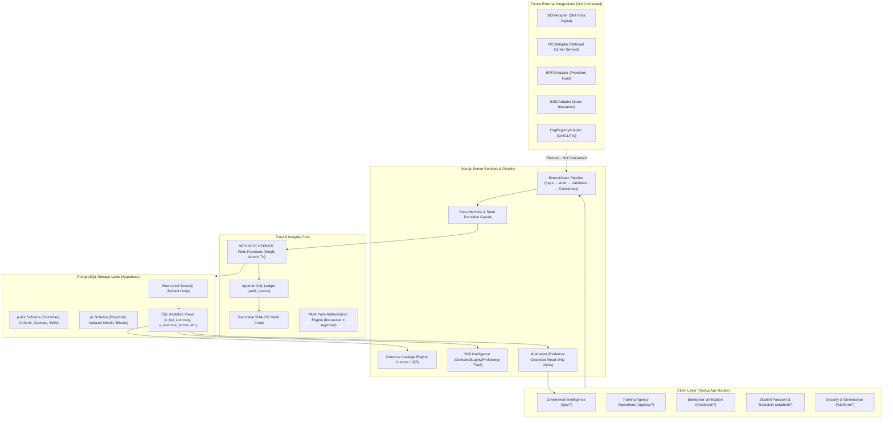

# System Architecture — Employment Outcome Intelligence (EOI) Platform

## 1. Overview & Thesis
The **Employment Outcome Intelligence (EOI) Platform** is a trusted, automated, longitudinal outcome layer that connects skilling records to verified employment trajectories and turns them into actionable program and skill intelligence for government.

```
TRUST → TRAJECTORY → INTELLIGENCE → ACTION
```

**Core design rule:** *The dashboard is not the source of truth. The verified event history is.*

---

## 2. High-Level Architecture Diagram



---

## 3. Service Boundaries

| Service Module | Responsibility | Key Invariant |
|---|---|---|
| `identity` | Authentication, session tokens, RBAC roles | Zero Trust per request; PII separation |
| `training` | Courses, cohorts, attendance, assessments | Agencies manage within own `agency_id` scope |
| `readiness` | Job readiness scoring formula | Algorithmic only; agencies cannot type scores |
| `employment` | Placement reporting, student history | Agencies cannot self-verify |
| `verification` | Enterprise confirm, reject, correction | Requires canonical legal org identifier |
| `trust` | Employment lifecycle state machine | No DELETE operations; transitions logged |
| `ledger` | Append-only event store, SHA-256 chain | `verify_ledger_chain()` returns any broken link |
| `analytics` | KPIs, funnel conversion, snapshots | Recalculation logs `ANALYTICS_RECALCULATED` |
| `skills` | Demand vs supply vs proficiency triad | Ingests corporate feedback + curriculum |
| `ai` | Natural language analytics explanations | Read-only views only; citations required |
| `governance` | Multi-party authorizations, anomalies | Requester ≠ Approver enforced |

---

## 4. Longitudinal State Machine

```
REPORTED → PENDING_VERIFICATION → VERIFIED_EMPLOYED
REPORTED → REJECTED
VERIFIED_EMPLOYED → UNEMPLOYMENT_REPORTED → RECONCILIATION_PENDING → VERIFIED_UNEMPLOYED
VERIFIED_UNEMPLOYED → NEW_EMPLOYMENT_REPORTED → VERIFICATION → VERIFIED_EMPLOYED
```

- Every critical write executes via `SECURITY DEFINER` functions in a single atomic transaction.
- When an employee departs, prior employment records remain permanently preserved in the student's passport and ledger history.
- Unemployment claims require employer reconciliation or timeout flags; a student cannot unilaterally declare themselves verified unemployed.
